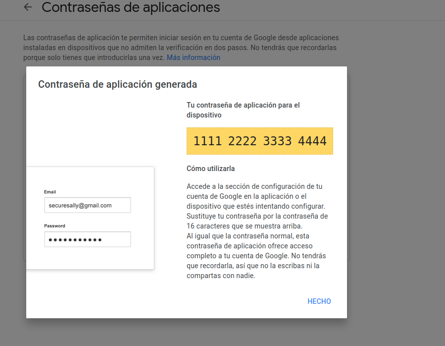

# CoDecode

----
#### Video Demo:  https://youtu.be/uPo8rZ-Xuho
#### Description:
##### Author  : Rodrigo Hormazabal (aka CainSoulless)
##### App     : CoDecode, Emails more secure.
##### Style   : PEP8
##### Ver.    : 1.0

CoDecode is an application for the safety email sending with encryption, it can help you with anonymity or even if the recipient mail is constantly intercepted by malicious entities.
The application can encrypt and decrypt the email and the most strong algorithm used is the AES_EAX, a standard used by the US government.

The applicacion has two sections, the encrypt email and the decrypt email, those previously descripted in the video demo.

The current algorithms used are two:
🔸Base64, not stronger, is easy to decode with any application or python script.
🔸AES_EAX, the strongest and recommended option.

AES_EAX could be a little confuse to use, you must to save the key previously generated, them download the file and share all
these information to the person who need to decrypt the message.
The Decrypt process is easy, you need go to the "Decode" option above on the nav bar, paste all the relevant information like
the key, the line1 and line2 of the downloaded file.

This application is created to have a more secure means of communication and to be able to transmit sensitive information, even if the receiving mail can be read by anyone, since if this person does not have the keys, they will not be able to understand the message itself.

----
### Usage:

The application must be configured previously of the usage. You must to provide an Gmail account with a App password, you can found the information below in the link.
[Gmail account configuration](https://support.google.com/accounts/answer/185833?hl=en)

Or following [this video.](https://www.youtube.com/watch?v=yMjutdwuUQQ)



Run the following script:
``` bash
python3 app.py
```

 \
And go to http://127.0.0.1:5000/

### Technical information:
CoDecode is created with Flask in the back-end, public modules of security and encrypt/decrypt information.
##### Back-end:
Jquery and Flask.
SQLITE3 in database.
##### Front-end:
HTML5, CSS3 with Bootstrap 5 and Javascript.
Jinja2 for template rendering.

The main file is "app.py", which calls various modules and libraries. The proper modules are those located in the static/python folder, the most important are "helpers.py" and "emailingSystem.py". In CSS I decided not to opt, yet, for an atomic architecture, since it takes a lot of time, which I did not have.
The way in which the page updates the data without refreshes is through the "handler.js" file located in "static/js", which generates Ajax objects to be later sent to the "app.py" in JSON format. Within "app.py" this is responsible for distributing what has to be done with said information.
So if you want to contribute you are welcome to share your code!.

### Warning:
This is not a software that you can use as a finished product. It can do his functions but is not really secure. I found a lot of security holes but for time I will not finish all the patchs until the end of the year.

## The Developer:
My name is Rodrigo Hormazabal, actually I am studying in DuocUC as Programmer Analyst, Chile but with a background in Cybersecurity and CTF player. But currently I just developing my skills as programmer in many programming languages.

----
### CS50
CS50 is a Harvard University's free introduction to the intellectual enterprises of computer science and the art of programming, taught by David Malan. Doug Lloyd and Brian Yu.
You can found more about CS50 in the following link:
https://pll.harvard.edu/course/cs50-introduction-computer-science?delta=0

